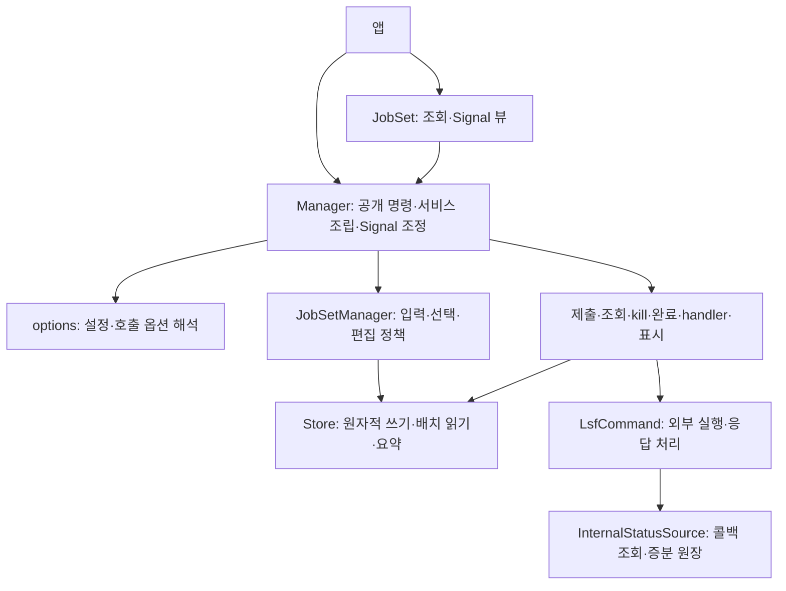

# LsfJobManager 전체 설계 검토·리팩터링 결과

기준: `d6d0708`, [실행 계획](full-architecture-refactor-plan-2026-09-05.md), AGENTS.md.
검토·구현: 2026-09-05~06. 전체 영역의 판단·구현·최종 통합 검증을 완료했다.

## 전체 판단

Qt facade, Store, 외부 명령 실행, 기능별 worker라는 큰 구분은 유지한다.
수정할 부분은 facade에 남은 입력·작업 선택 정책, 편집의 과도한 읽기,
제출 착수와 재시도 결과의 소유권, 외부 조회의 불필요한 위임,
MockLSF의 DB 연결 정리다. 개별 결함 유무와 책임 배치의 적절성은 따로 판단했다.

| 영역 | 결정 | 근거·변경 내용 |
| --- | --- | --- |
| 공개 API / manager / handle / export | 책임 재배치 | 명령은 mgr, handle은 조회·Signal이라는 요구를 유지한다. facade의 config 구성은 options로, 레코드 구성·참조 해석·제출 가능 상태 판단은 기존 JobSetManager로 옮긴다. can_submit과 submit이 같은 도메인 검사를 사용한다 |
| 생성·편집·삭제 / jobset_core | 단순화·성능 개선 | 동일 소속·중복 key 검사와 메타데이터 수 정산을 공유한다. key 선택에서 전체 레코드의 사전을 반복 생성하지 않고 기존 배치 key 조회를 사용한다 |
| states / reports / store | 기반 유지·갱신 규칙 통합 | 관측값과 추적 레코드, 실행 세대와 revision은 서로 다른 의미이므로 유지한다. 실제 레코드 수를 Store가 제공하고, 기존 레코드의 timestamp·revision 갱신을 한 곳에서 수행한다 |
| submitter / lifecycle | 착수 경로 통합·소유권 수정 | pre_submit 유무마다 coordinator task와 착수 예외 처리가 나뉜다. 하나의 착수 task가 선택적인 게이트와 공통 착수를 수행하게 한다. 지연 retry 요청은 jsid로 현재 context를 다시 찾지 않고 요청을 만든 context를 전달한다 |
| command | 단순화·캐시 경계 수정 | bjobs만 사용하는 callback 기반 chunk 실행 helper와 한 번 더 감싼 query wrapper를 제거했다. 연도 없는 날짜의 현재 시각 의존 판단을 포맷 해석 캐시에서 분리했다 |
| internal_status | 유지 | 파싱은 이미 순수 함수, 증분 원장·관심 ID·동시 조회 합치기는 한 Condition 아래에 있다. timeout 인계, failover, 종료 항목 보존은 실제 요구다. 이를 삭제하거나 단순한 dict 캐시로 바꾸면 요구를 잃는다 |
| monitor | 유지·의존 정렬 | 조회→병합→조건부 갱신과 Qt polling worker의 책임은 분리돼 있다. JobStatus는 정의된 states에서 직접 참조한다. 최근 query_ids 정리와 실행별 미발견 횟수 경계는 유지한다 |
| killer / completion | 유지 | 최근 수정한 활동 수명·실행 식별·결과 전달 계약을 재검토했다. CompletionTracker는 manager의 완료 조정용 내부 부품이다. 이를 독립 서비스로 바꾸려면 종료 상태와 여러 서비스·Signal을 다시 주입해야 한다. 현재 요구에서 그 추가 배선보다 이 내부 결합을 유지하는 편이 단순하다 |
| handlers / pacer / Qt | 유지 | handler의 실행 중 표시, 완료 처리 기록, pacer의 표시 대기열은 별개 요구다. 이미 수락한 재제출 표시 순서와 삭제·교체 정리를 보존한다. Qt 차이 처리는 qt.py 한 곳, 종료 순서는 manager가 소유한다 |
| config / options / errors / util | 책임 재배치·유지 | 숫자 범위와 명령 경로 검증은 config, 호출 옵션의 우선순위는 options가 소유한다. config→manager defaults 변환도 options에 둔다. 오류 타입, worker 상한, throttling, identity 원장 helper는 실제 호출부가 있어 유지한다 |
| MockLSF db / CLI | 자원 수명 통합·단순화 | CLI마다 성공·조기 반환 경로에서 close를 반복한다. 표준 context manager로 명령의 DB 연결 수명을 묶는다. DB 행 복원은 기존 컬럼 목록을 사용해 필드 목록의 중복을 없앤다 |
| MockLSF scheduler / daemon / 모델·포맷·제출·설정 | 유지·정리 | 저장 성공분만 스케줄링 이벤트를 발행하는 경계와 CLI 상태 갱신은 유지한다. 데몬의 DB 회수도 실행 범위에 묶는다. 표시 포맷과 제출 시뮬레이션은 라이브러리의 상태 모델에 합치지 않는다 |
| 테스트 / 문서 / 예제 / 진단 | 계약별 검증 | 공개 API 시나리오를 유지하고 내부 경계가 바뀐 테스트는 새 소유자에서 같은 조건을 검사한다. 문서의 동기 편집·비동기 실행 구분 및 현재 지원 동작과 어긋난 설명을 정리한다 |

예제의 종료 처리도 수정했다. `mocklsfd stop` 실패·timeout 시 실행 디렉토리를
지우던 경로가 있어, subprocess의 성공을 확인한 뒤에만 디렉토리를 회수한다.
실제 daemon/CLI의 기존 정지 성공 계약을 예제에서도 사용한다.

## 책임과 의존 방향

CompletionTracker의 manager 참조는 이 도식의 실행 의존과 별개인 내부 조정
참조다. 패키지의 런타임 import 순환과 상태·설정·오류·Qt leaf 의존은 기존
계층 테스트로 검증한다. Store 아래에 Qt나 외부 I/O를 넣지 않는다.

| 데이터·자원 | 소유자 | 정리·검증 경계 |
| --- | --- | --- |
| JobRecord·실행 세대·revision·요약 | Store, 실행 교체 요청자 | Store 갱신 시 revision 증가, 교체/재제출 시 세대 변경 |
| 선택 key와 편집 정책 | JobSetManager | 명령 입력에서 해석, 실제 변경분을 manager에 반환 |
| 제출 context·재시도·진행률 | BulkSubmitter | 한 context의 착수부터 완료까지, 재시도도 해당 context를 사용 |
| 제출 등록·kill barrier | SubmitGate | 등록과 barrier 변경은 같은 잠금, 기다림은 잠금 밖 |
| 조회 대상·미발견 횟수 | JobsetQuerier | 같은 JobSet 조회 직렬화, Store와 같은 실행인지 확인 |
| 콜백 원장·미회수 조회·health | InternalStatusSource | Condition 하에서 상태 갱신, callback 실행은 잠금 밖 |
| handler 실행·표시 대기열 | 각 Qt 서비스 | main에서 등록·평가, callback은 worker, 삭제·교체 시 추적 정리 |
| 서비스 종료 순서 | Manager | 새 API 요청 차단, 조회원 종료 후 polling join, killer join 후 bkill 풀 종료 |
| SQLite 연결 | MockLSF 명령/데몬 실행 범위 | 정상·조기 반환·예외 모두 같은 연결 회수 경계 |

## 구현·검증 기록

### 책임 변경과 제거한 중복

- **Manager → options / JobSetManager**: 설정 구성, 레코드 생성, key/ID 해석,
  제출 대상·상태 검사를 기존 소유자로 옮겼다. `can_submit`과 `submit`이 같은
  검사를 사용한다. Manager의 메서드는 65→58개, 파일은 1,412→1,211줄이다.
  이 수치는 책임 이동 결과이며 설계 품질의 판정 기준은 아니다.
- **JobSetManager → Store의 배치 조회·계수**: key API에서 전체 작업 목록을
  읽지 않는다. `count_jobs`는 실제 레코드 수를 제공하고, `summary`의 미생성
  `intended_count` 몫과 구별된다. InMemoryStore는 O(1), Store 기본 구현은
  기존 `get_jobs`를 사용하므로 사용자 Store에 필수 구현 메서드가 늘지 않는다.
  삭제는 Store가 실제 삭제한 레코드를 반환해, 선택 이후 확보된 job_id도 정리한다.
- **제출 착수**: pre_submit 유무를 한 `_LaunchTask`에서 처리한다. 게이트 거부는
  레코드 리셋 전에 정산하고, 착수 예외는 이번 착수의 실제 리셋분에만 적용한다.
  재시도 요청에는 요청을 만든 context를 전달한다. shutdown의 retry 정산도
  기존 취소 원장 처리 경로를 사용한다.
- **Store 갱신**: 기존 레코드의 timestamp·revision 증가를 한 쓰기 함수에서
  수행한다. 배치 전이의 잠금 1회, 공통 시각, 증분 요약은 유지한다.
- **외부 조회**: bjobs만 쓰는 범용 callback helper와 중간 query wrapper를
  제거했다. chunk 격리·연속 실패 중단의 동작은 유지한다. 날짜 캐시는 포맷
  해석과 현재 시각에 따른 연도 보정을 분리한다. 한 bjobs 응답은 같은 기준
  시각을 사용한다.
- **MockLSF**: 9개 CLI 명령과 daemon의 DB 수명을 `contextlib.closing`으로
  묶었다. DB 행→Job 변환은 기존 컬럼 목록을 공유한다. 새 자원 관리 계층은 없다.

### 결함과 재현 범위

| 문제 | 수정 근거·회귀 검증 |
| --- | --- |
| 선택 제출의 pre_submit 예외가 미선택 SUBMITTING도 실패 처리 | `test_submission_lifecycle.py`: 선택 a의 게이트 예외 뒤 미선택 b의 상태·revision 불변 |
| 이전 제출의 queued retry가 같은 jsid의 새 제출에 timer 등록 | 같은 파일: worker 신호를 지연시켜 이전 context 종료→새 context 등록→신호 처리 순서를 고정 |
| 연도 없는 LSF 날짜가 최초 조회 시각의 연도로 고정 | `test_command.py`: 같은 문자열을 다른 기준 날짜 및 같은 날의 다른 시각에 조회. 기존 윤년·연말 테스트도 유지 |
| 삭제 대상 스냅샷 뒤 확보된 ID가 cleanup에서 유실 | `test_job_selection.py`: 삭제 직전에 PEND+job_id를 기록하고 실제 삭제분의 ID가 forget되는지 검사 |
| 내부 편집 배치의 소속·중복 key 오류가 부분 반영 | 같은 파일: 유효 레코드 뒤 잘못된 레코드를 배치하고 Store가 그대로인지 검사 |
| MockLSF 명령 예외 시 DB 연결 미회수 | `test_mocklsf.py`: 출력 처리 예외 후 sqlite 연결 사용이 거부되는지 검사 |
| 예제가 daemon stop 실패에도 DB 디렉토리를 삭제 | `test_example_lifecycle.py`: 성공·비정상 종료·timeout을 구분해 성공 때만 삭제 |

최초 구현 전 재현 검사 9건은 모두 실패했다(선택 비용 계약 5건, 제출 경합 2건,
날짜·DB 회수 각 1건). 예제의 추가 검사는 수정 전 실패 2건·성공 1건을 확인했다.
그 외 새 검사는 삭제·편집·계수 계약을 검증한다. 기존 내부 함수 호출 테스트는
같은 검증 내용을 새 소유자에서 검사하도록 옮겼고, argv 왕복 검사는 공개
`submit`이 runner에 전달하는 실제 인자로 확인하도록 바꿨다.

### 전체 계약의 검증 대응

| 영역 | 대표 검증 |
| --- | --- |
| 공개 API·옵션·참조 | `test_api_naming`, `test_options`, `test_jobset_ref`, `test_rare_inputs`, `test_job_selection` |
| 모델·Store·편집 | `test_store_contract`, `test_store_batch_apis`, `test_jobset`, `test_jobset_v9` |
| 제출·활동 수명·취소 | `test_submitter`, `test_pre_submit`, `test_phase_order`, `test_submission_lifecycle`, `test_started_finished_pairing` |
| 조회·원장·삭제·캐시 | `test_command`, `test_internal_status`, `test_stale_ids`, `test_clock_skew`, `test_review_round4` |
| kill·완료·handler·표시 | `test_killer`, `test_jobset_finished`, `test_handlers`, `test_execution_lifecycle`, `test_architecture_review` |
| 계층·종료·복합 경합 | `test_module_layering`, `test_shutdown_boundary`, `test_chaos`, `test_zz_chaos_large` |
| MockLSF·예제 | `test_mocklsf`, `test_example_lifecycle`, GUI 생성·자동 종료 smoke |

최종 전체 실행은 `QT_QPA_PLATFORM=offscreen`, `QT_API`와 `PYTEST_QT_API`를
각 바인딩에 맞춰 `python -m pytest -q --tb=short`로 수행했다.

| 바인딩 | 결과 | 시간 |
| --- | ---: | ---: |
| PySide6 | 1,160 passed | 227.36초 |
| PyQt5 | 1,160 passed | 219.36초 |

기준 커밋의 1,143개에 회귀·계약 검사 17개가 추가됐다. 관련 단위 검사 후
통합 검증을 수행했고, 마지막 성능 조정과 예제 수정도 위 전체 실행에 포함했다.
`git diff --check`도 통과했다.

### 성능 측정

Python 3.12.1, PySide6, 동일 머신에서 기준 커밋의 별도 읽기 전용 복사본과
현재 코드를 비교했다. 각 항목은 워밍업 후 25회 중앙값이다. 각 Store에는
1,000개 또는 100,000개의 CREATED 작업을 만들었고 선택 수는 500개다.
공개 편집 API의 동기 비용을 측정하기 위해 자동 폴링 시작만 껐다. 레코드 구성,
검증, Store 갱신과 동기 Signal 처리는 측정에 포함한다.

| 연산 | 1천 건: 변경 전 → 후 | 10만 건: 변경 전 → 후 |
| --- | ---: | ---: |
| 선택 500건 `can_submit` | 0.309 → 0.311 ms | 25.754 → 0.312 ms |
| 1건 `set_user_data` | 0.196 → 0.088 ms | 25.790 → 0.084 ms |
| 500건 `replace_jobs` | 23.996 → 24.461 ms | 48.669 → 24.572 ms |
| 500건 `transition_many` | 7.835 → 8.388 ms | 7.646 → 8.233 ms |

작은 선택 연산이 전체 Store 크기에 비례해 느려지는 경로를 제거했다. 정수
job_id 해석과 소속 없는 전역 kill의 검색은 기존 범위 조회를 유지한다. 별도
전역 ID 인덱스와 그 동기화 책임은 추가하지 않았다.

쓰기 규칙 통합에 따른 배치 전이 비용은 500건당 약 0.6ms 늘었다. 연도 없는
start/finish를 포함한 bjobs 1만 행의 반복 파싱은 84.062→97.825ms였다.
날짜 캐시의 정확성 수정에는 약 14ms의 비용이 있으며, 포맷 해석을 한 번에
캐시하고 응답 전체의 기준 시각을 공유해 반복 작업을 제한했다. 측정값은
로컬 미세 벤치마크이며 실제 클러스터의 응답 시간이나 GUI 전체 지연을 뜻하지 않는다.
기존 폴링의 선택 key 조회 계약은 `test_stale_ids`로 함께 검증했다.

### 공개 동작과 검증 한계

Manager의 공개 메서드 시그니처와 명령/조회 분리는 유지한다. Store의
`count_jobs`만 기본 구현이 있는 연산으로 추가된다. 변경된 내부 함수의
호환 wrapper는 남기지 않는다. 새 상태값·실행 플래그·패키지 계층은 추가하지 않았다.

문서의 전부 비동기 명령, jobset별 제출 풀, 자동 job_key, 제거된 클러스터별
kill 설정 설명을 현재 계약에 맞췄다. `tools/lsf_selfcheck.py --help`가 실행되고,
offscreen GUI 예제가 생성 후 자동 종료되며 manager 종료 로그에 잔여 스레드가
없음을 확인했다. 실제 LSF 클러스터에서는 실행하지 않았다. 클러스터별 출력과
외부 서비스 장애 특성은 FakeLsf·MockLSF 테스트만으로 보장하지 않는다.
